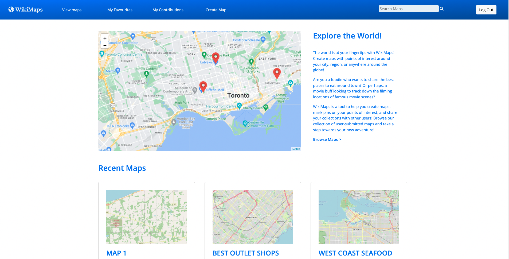
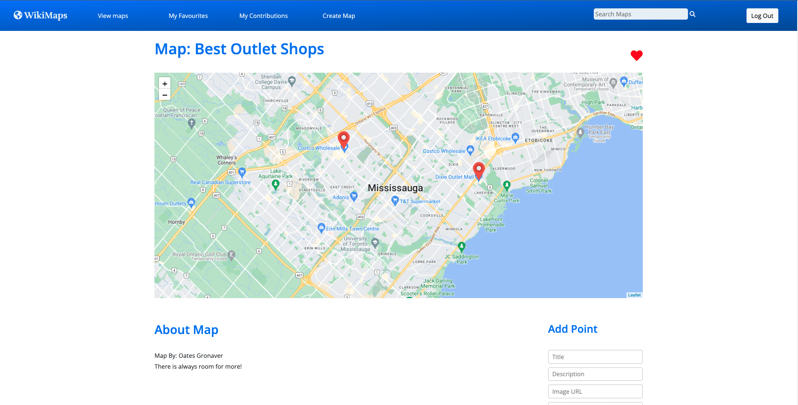
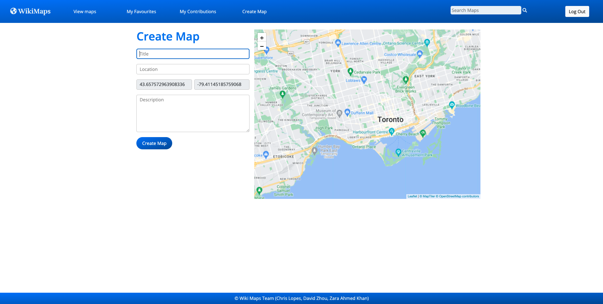
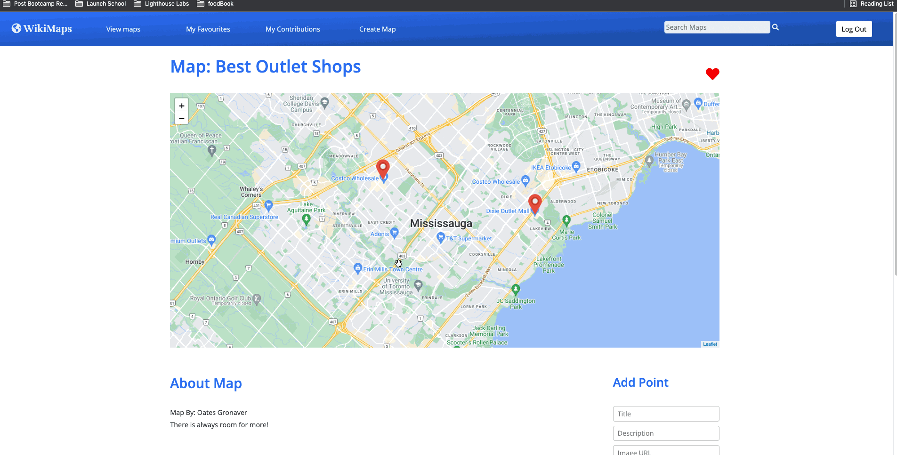
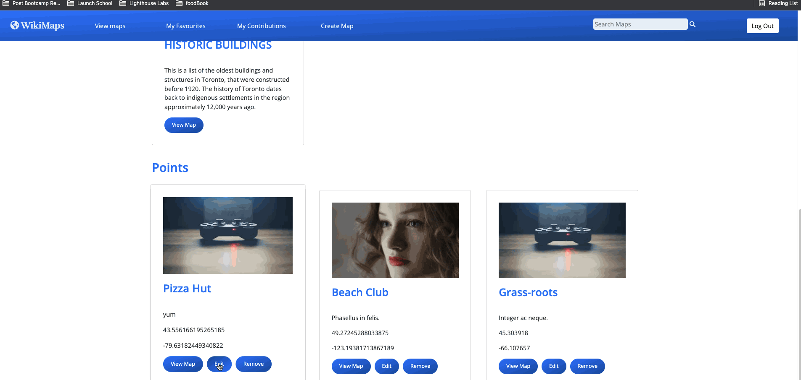
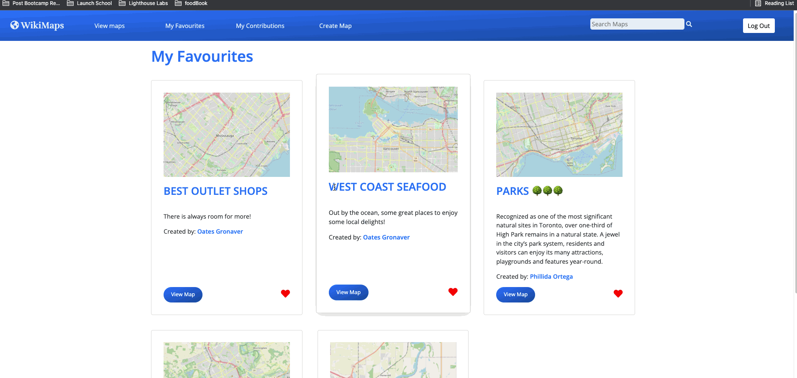
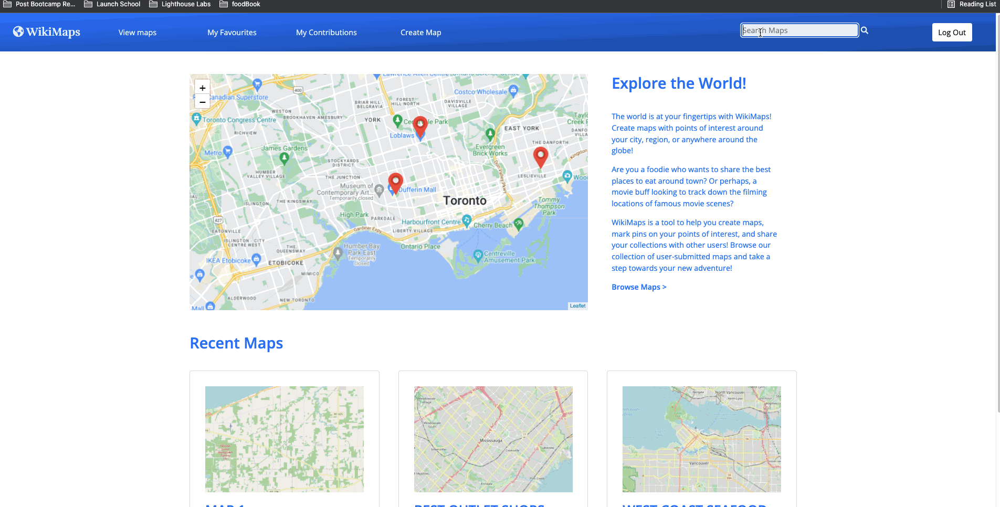

WikiMaps
=========

## Contributors

## Overview

The world is at your fingertips with WikiMaps! Create maps with points of interest around your city,
region, or anywhere around the globe!
Are you a foodie who wants to share the best places to eat around town? Or perhaps, a movie buff lookingto track down the filming locations of famous movie scenes?
WikiMaps is a tool to help you create maps, mark pins on your points of interest, and share your
collections with other users! Browse our collection of user-submitted maps and take a step towards your new adventure!

## Final Product

Home Page:

View Maps:

Map Page:

Create Maps:

Add points:

Edit points:

Add and Remove favourite maps:

Search maps:

## Getting Started

1. Create the `.env` by using `.env.example` as a reference: `cp .env.example .env`
2. Update the .env file with your correct local information 
  - username: `labber` 
  - password: `labber` 
  - database: `midterm`
3. Install dependencies: `npm i`
4. Fix to binaries for sass: `npm rebuild node-sass`
5. Reset database: `npm run db:reset`
  - Check the db folder to see what gets created and seeded in the SDB
7. Run the server: `npm run local`
  - Note: nodemon is used, so you should not have to restart your server
8. Visit `http://localhost:8080/`

## Dependencies

- Node 10.x or above
- NPM 5.x or above
- PG 6.x
- Staticmaps 1.7.0

## Tech Stack

 

